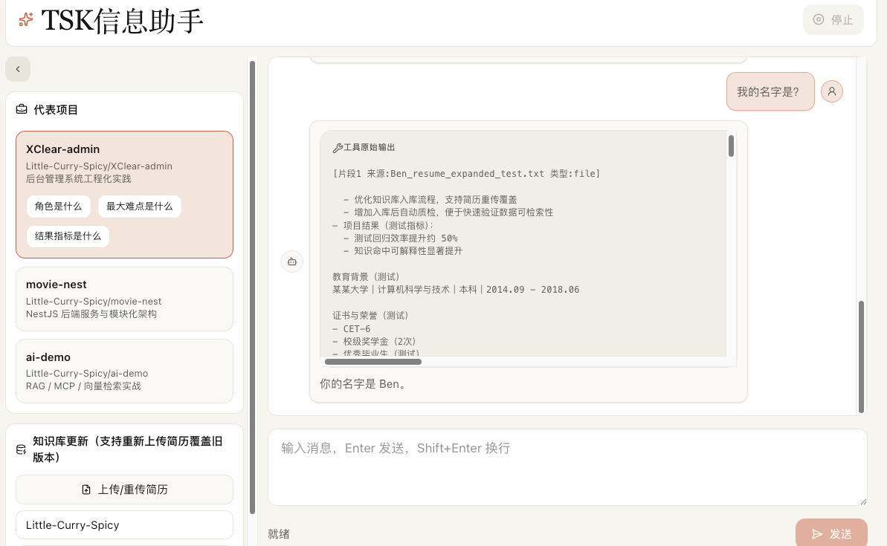

# TSK 信息助手（RAG 个人知识库问答系统）

一个可用于“个人信息智能问答”的前后端一体项目。  
系统会将简历文件和 GitHub 公开仓库内容写入向量库，通过 RAG 检索后生成更准确的回答。

---

## 效果预览



---

## 1. 项目目标

解决以下场景：

- 面试或项目介绍时，快速回答“你是谁、做过什么、项目难点是什么”
- 将个人资料结构化沉淀为可检索知识库，避免临场遗忘
- 支持持续更新：简历重传、GitHub 仓库增量/重建入库

---

## 2. 功能总览

### 2.1 对话问答

- 入口接口：`POST /ai/chat`
- 支持流式返回
- 可配置 API Key 保护接口

### 2.2 知识库入库

- 文件入库：`POST /knowledge/ingest/file`
  - 支持 `txt / pdf / docx`
  - 支持同名覆盖（默认）或追加
- GitHub 入库：`POST /knowledge/ingest/github`
  - 拉取指定用户公开仓库及 README

### 2.3 检索与质量保障

- 检索工具：语义检索个人知识片段后再回答
- 质检接口：`POST /knowledge/quality-check`
- 入库结果返回 `qualityReport`，便于判断可用性

---

## 3. 技术架构

```text
前端（front, React + Vite + TS）
        │
        ▼
后端 API（backend, NestJS + LangChain）
        │
        ▼
向量数据库（Qdrant）
```

- `front`：聊天 UI、项目快捷提问、上传简历、GitHub 同步
- `backend`：对话编排、知识入库、向量检索、质量检查

---

## 4. 目录结构

```text
.
├── backend/                  # NestJS 后端服务
├── front/                    # React 前端应用
├── pic.png                   # README 效果图
└── README.md                 # 项目总文档（当前文件）
```

---

## 5. 环境要求

- Node.js >= 20
- `pnpm`（统一包管理工具）
- 可用的 Qdrant 实例（云端或自建）
- 可用的大模型兼容 OpenAI API 地址

---

## 6. 快速开始

## 6.1 安装依赖

```bash
pnpm --dir backend install
pnpm --dir front install
```

## 6.2 配置后端环境变量

在 `backend/.env` 新建并填写：

```env
# ===== LLM =====
MODEL_NAME=qwen-plus
OPENAI_API_KEY=your_api_key
OPENAI_BASE_URL=https://dashscope.aliyuncs.com/compatible-mode/v1

# ===== 可选：联网搜索 =====
BOCHA_API_KEY=your_bocha_key

# ===== Qdrant =====
QDRANT_URL=https://your-qdrant-url
QDRANT_API_KEY=your_qdrant_api_key
QDRANT_COLLECTION=personal_intro
EMBEDDING_MODEL=text-embedding-v4
EMBEDDING_DIMENSIONS=1024

# ===== 可选：接口鉴权 =====
FRIEND_API_KEY=your_secure_random_key

# ===== 可选：提高 GitHub API 额度 =====
GITHUB_TOKEN=your_github_token
GITHUB_USER_AGENT=agui-backend
```

参数说明（核心）：

- `OPENAI_BASE_URL`：兼容 OpenAI 的模型网关地址
- `QDRANT_COLLECTION`：向量集合名，默认 `personal_intro`
- `EMBEDDING_DIMENSIONS`：向量维度，必须与 embedding 输出一致
- `FRIEND_API_KEY`：配置后所有关键接口将需要鉴权

## 6.3 配置前端环境变量（可选）

前端可通过 `VITE_API_BASE` 指向后端地址。

- 本地直连后端：`VITE_API_BASE=http://localhost:3001`
- 不配置：默认使用相对路径（适合代理或同源部署）

## 6.4 启动开发环境

启动后端：

```bash
pnpm --dir backend start:dev
```

启动前端：

```bash
pnpm --dir front dev
```

默认访问地址：

- 前端：`http://localhost:5173`
- 后端：`http://localhost:3001`

---

## 7. 接口文档（重点）

## 7.1 聊天接口

### `POST /ai/chat`

用途：发起流式问答。

当配置 `FRIEND_API_KEY` 时，请求头需包含以下任一方式：

- `Authorization: Bearer <FRIEND_API_KEY>`
- `X-Friend-Api-Key: <FRIEND_API_KEY>`

请求体示例：

```json
{
  "messages": [
    {
      "id": "u1",
      "role": "user",
      "parts": [{ "type": "text", "text": "你好，请介绍一下我自己" }]
    }
  ]
}
```

返回：流式响应（SSE/流输出）。

## 7.2 文件入库接口

### `POST /knowledge/ingest/file`

用途：上传简历或文本资料并写入知识库。

- 请求类型：`multipart/form-data`
- 文件字段名：`file`
- 支持类型：`txt / pdf / docx`

Query 参数：

- `replace=1`（默认）：同名覆盖（先删旧分块再写新分块）
- `replace=0`：追加（不删除旧分块）

示例：

```bash
curl -X POST "http://localhost:3001/knowledge/ingest/file?replace=1" \
  -F "file=@./resume.pdf"
```

关键返回字段：

- `chunksIndexed`：本次新增分块数量
- `deletedChunks`：覆盖时删除的旧分块数量
- `qualityReport`：入库质量检测结果

## 7.3 GitHub 入库接口

### `POST /knowledge/ingest/github`

用途：抓取 GitHub 公开仓库内容并入库。

请求体：

```json
{
  "username": "Little-Curry-Spicy",
  "maxRepos": 15
}
```

参数：

- `username`：必填，GitHub 用户名
- `maxRepos`：可选，范围 `1~50`，默认 `15`

## 7.4 手动质检接口

### `POST /knowledge/quality-check`

文件数据质检示例：

```json
{
  "profile": "file",
  "source": "resume.docx"
}
```

GitHub 数据质检示例：

```json
{
  "profile": "github",
  "username": "Little-Curry-Spicy"
}
```

---

## 8. 前端功能说明

当前前端页面支持：

- 聊天问答（流式展示）
- 代表项目卡片与快捷问题按钮（角色 / 难点 / 结果）
- 简历上传与重传（知识库更新）
- GitHub 用户仓库同步入库
- 引用内容继续追问

---

## 9. Docker 部署

在根目录准备好 `backend/.env` 后执行：

```bash
docker compose up -d --build
```

可选在根目录新增 `.env` 作为 compose 变量：

```env
HTTP_PORT=3001
VITE_CLERK_PUBLISHABLE_KEY=
VITE_CLERK_ENABLED=
# VITE_API_BASE=
```

部署说明：

- 页面访问：`http://<服务器IP>:${HTTP_PORT:-3001}`
- 前端通过 Nginx 同源反代访问后端（`/ai`、`/knowledge`）

---

## 10. 常见问题（FAQ）

### Q1：上传文件提示未配置 Qdrant

检查 `backend/.env` 中 `QDRANT_URL` 和 `QDRANT_API_KEY` 是否正确。

### Q2：接口返回 401

若已配置 `FRIEND_API_KEY`，请求必须带鉴权头。

### Q3：前端调用失败或跨域

优先确认后端是否启动，再检查 `VITE_API_BASE` 与代理配置是否一致。

---

## 11. 常用命令速查

后端：

```bash
pnpm --dir backend start:dev
pnpm --dir backend build
pnpm --dir backend test
```

前端：

```bash
pnpm --dir front dev
pnpm --dir front build
pnpm --dir front preview
```

---

## 12. 迭代建议（后续可做）

- 增加“知识库版本历史”与回滚能力
- 增加“入库任务状态面板”（排队、成功、失败、耗时）
- 增加“答案溯源片段高亮”，提升可解释性
