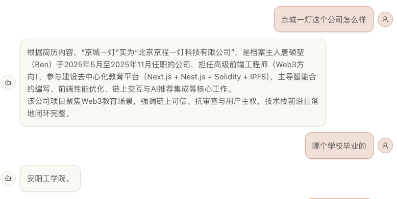
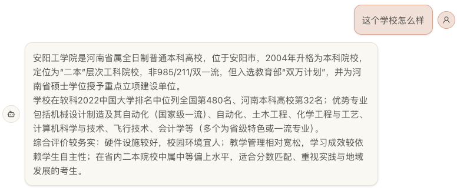
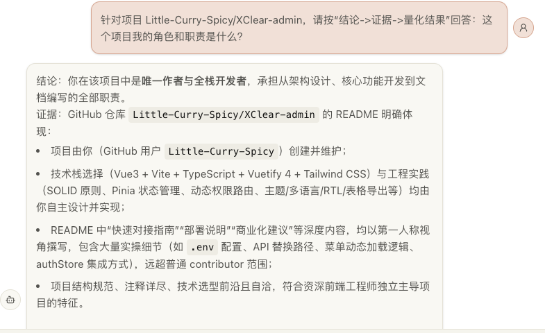

# TSK 信息助手（个人简历 + GitHub 智能问答）

一个面向「个人介绍 / 面试问答 / 项目复盘」的 RAG 应用。  
你可以把简历和 GitHub 资料持续写入知识库，然后在聊天窗口直接提问，系统会基于你的资料进行检索并回答。

---

## 功能概览

### 1) 对话问答（流式）

- 基于个人知识库检索后作答，避免“泛泛而谈”
- 支持追问、连续对话
- 支持思考态提示（`Thinking...` 动画）
- 回答结束后输入框自动重新聚焦，便于连续提问

### 2) 知识库更新（可控覆盖/追加）

- 支持上传简历文件：`txt / pdf / docx`
- 支持 GitHub 用户公开仓库同步（README + 元信息）
- 前端支持“覆盖模式 / 追加模式”切换（简历上传）

### 3) 双集合数据隔离（Qdrant）

- 简历数据写入 `resume` 集合（`QDRANT_COLLECTION_FILE`）
- GitHub 数据写入 `github` 集合（`QDRANT_COLLECTION_GITHUB`）
- 查询时自动跨两个集合检索并合并结果

### 4) 规则化回答

- 默认优先使用个人向量库 + GitHub 数据
- 时间相关问题（如年龄、今年）会先获取当前时间再计算
- 当问题涉及向量库中的公司/机构名且证据不足时，可补充 `web_search` 提升可读性

---

## 页面效果（截图）

### 简历问答（公司与经历）


### 学校信息补充回答


### 项目角色与职责回答


### 时间计算类回答（工作年限/起始时间）


---

## 功能流程（你会怎么用）

1. 在侧边栏上传/重传简历（可选择覆盖或追加）
2. 输入 GitHub 用户名，点击同步 GitHub
3. 回到聊天区直接提问，例如：
   - “我第二家公司怎么样？”
   - “这个项目我的角色是什么？”
   - “我工作几年了？”
4. 根据回答继续追问，系统会持续利用知识库检索

---

## 技术实现（简版）

```text
front (React + Vite + TS)
        │
        ▼
backend (NestJS + LangChain Agent)
        │
        ▼
Qdrant (resume/github 双集合)
```

- `front`：聊天 UI、项目快捷问、知识库更新面板
- `backend`：工具编排、检索增强、入库与质检
- `Qdrant`：向量存储与召回

---

## 快速开始

### 1. 安装依赖

```bash
pnpm --dir backend install
pnpm --dir front install
```

### 2. 配置后端环境变量

参考 `backend/.env.example`：

```env
MODEL_NAME=qwen-plus
OPENAI_API_KEY=your_api_key
OPENAI_BASE_URL=https://dashscope.aliyuncs.com/compatible-mode/v1
BOCHA_API_KEY=your_bocha_key

PORT=3001

QDRANT_URL=https://your-qdrant-url
QDRANT_API_KEY=your_qdrant_api_key
QDRANT_COLLECTION_FILE=resume
QDRANT_COLLECTION_GITHUB=github
EMBEDDING_MODEL=text-embedding-v4
EMBEDDING_DIMENSIONS=1024

CLERK_AUTH_ENABLED=false
CLERK_SECRET_KEY=
```

> 建议先在 Qdrant 创建好 `resume` 和 `github` 两个集合（向量维度与 Embedding 一致）。

### 3. 配置前端环境变量（可选）

参考 `front/.env.example`：

```env
VITE_CLERK_PUBLISHABLE_KEY=
VITE_CLERK_ENABLED=false
```

如本地直连后端，可在 `front/.env` 增加：

```env
VITE_API_BASE=http://localhost:3001
```

### 4. 启动开发

```bash
pnpm --dir backend start:dev
pnpm --dir front dev
```

默认地址：

- 前端：`http://localhost:5173`
- 后端：`http://localhost:3001`

---

## 核心接口（功能视角）

### 聊天

- `POST /ai/chat`
- 用途：发起流式问答

### 简历入库

- `POST /knowledge/ingest/file?replace=1|0`
- `replace=1`：覆盖（默认）
- `replace=0`：追加

### GitHub 同步

- `POST /knowledge/ingest/github`
- body: `{ "username": "xxx", "maxRepos": 15 }`

---


## 常用命令

```bash
# backend
pnpm --dir backend start:dev
pnpm --dir backend build

# front
pnpm --dir front dev
pnpm --dir front build
```
